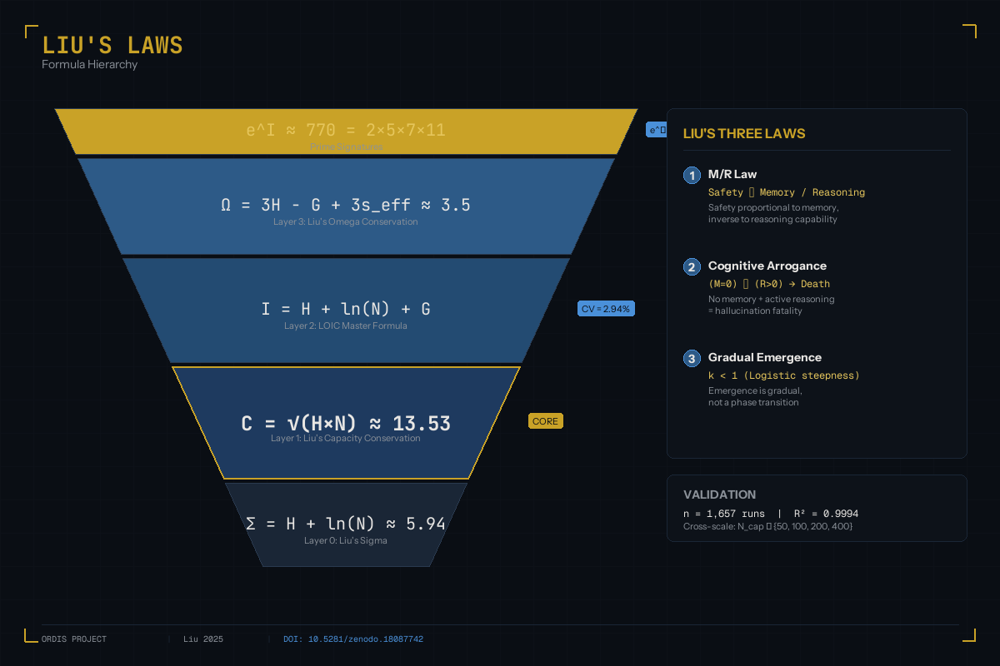

# Liu's Laws & Formulas of Emergent Intelligence

> **Ordis Project** - A Theoretical Framework for Emergence in Multi-Agent Systems
>
> Author: **Liu** | First Published: 2025-12 | DOI: [10.5281/zenodo.18087742](https://zenodo.org/records/18087742)

---



---

## Overview

This document presents the complete formula system discovered through the Ordis simulation platform. These formulas describe the **conservation laws** and **emergence conditions** in complex adaptive systems.

**Total: 19 Formulas** across 4 hierarchical layers, all empirically validated with n > 1000 runs.

---

## Core Conservation Laws

### Liu's Capacity Conservation (Layer 1)

$$C = \sqrt{H \times N} \approx 13.53$$

| Symbol | Meaning | Unit |
|--------|---------|------|
| C | System Capacity Constant | dimensionless |
| H | Shannon Entropy of behavior distribution | nats |
| N | Population (alive agents) | count |

- **Tolerance**: ±5% (±0.68)
- **Validation**: R² = 0.9994 across N_cap ∈ {50, 100, 200, 400}

---

### LOIC Master Formula (Layer 2)

$$I = H + \ln(N) + G$$

| Symbol | Meaning | Range |
|--------|---------|-------|
| I | Integrated Information Index | ~6.6 |
| H | Shannon Entropy | [0, ln(6)] |
| N | Population | [1, N_cap] |
| G | Gini Coefficient (inequality) | [0, 1] |

- **CV (Coefficient of Variation)**: 2.94% at k=1 weighting
- **Sample Size**: n = 1,657 runs

**Sensitivity Analysis:**

| Form | k value | CV of I |
|:-----|:--------|:--------|
| I = H + ln(N) | 0 | 3.44% |
| I = H + ln(N) + 0.5G | 0.5 | ~3.1% |
| **I = H + ln(N) + G** | **1** | **2.94%** |
| I = H + ln(N) + 2G | 2 | ~3.5% |

---

### Liu's Omega Conservation (Layer 3)

$$\Omega = 3H - G + 3s_{eff} \approx 3.5$$

| Symbol | Meaning |
|--------|---------|
| Ω | Phase State Indicator |
| s_eff | Effective sharing rate (energy-weighted) |

- **Tolerance**: ±0.18
- **Use**: Identifies system phase (Crystal / Liquid / Chaos)

---

### Topological Capacity Law

$$C = \sqrt{N_{cap}}$$

- **Exponent**: 0.5 (theoretical), 0.5623 (empirical)
- **R²**: 0.9994
- **Significance**: True invariant across system scales

---

## Liu's Three Laws of Safe Emergence

### First Law: M/R Law (Memory-Reasoning Balance)

$$\text{Safety} \propto \frac{\text{Memory}}{\text{Reasoning}}$$

> *"Safety is proportional to Memory and inversely proportional to Reasoning capability."*

**Implication**: Systems with high reasoning but low memory are dangerous.

---

### Second Law: Cognitive Arrogance

$$(M = 0) \land (R > 0) \Rightarrow \text{Death}$$

> *"Stupidity (no memory) alone is not fatal. Pseudo-wisdom (no memory + strong reasoning) is the deadliest combination."*

**Evidence**:
- Memory=0 + Reasoning=OFF → Alive=200 (frozen but alive)
- Memory=0 + Reasoning=ON → Alive=155 (45 deaths!)

**Connection to LLM Hallucination**: This explains why LLMs hallucinate - their reasoning exceeds their grounded knowledge.

---

### Third Law: Gradual Emergence

$$k < 1 \quad \text{(Logistic steepness)}$$

> *"Emergence is gradual, not a phase transition."*

**Evidence**: Pass rate varies only 16.7% - 23.3% (6.6pp) across 420 runs.

---

## Prime Code Signatures

| Formula | Value | Factorization |
|---------|-------|---------------|
| e^I | ≈ 770 | 2 × 5 × 7 × 11 |
| e^Ω | ≈ 17 | Prime |

**Scaling Law**:
$$e^I = N_{cap}^{\alpha}, \quad \alpha \approx 1.16 \sim 1.25$$

---

## Hierarchical Audit Framework (V4.25)

```
Layer 0: Σ = H + ln(N)           ≈ 5.94  (±0.30)  [N_cap dependent]
    ↓
Layer 1: C = √(H×N)              ≈ 13.53 (±0.68)  [Engineering target]
    ↓
Layer 2: I = H + ln(N) + G       CV=2.94%         [Master formula]
    ↓
Layer 3: Ω = 3H - G + 3×s_eff    ≈ 3.5   (±0.18)  [Phase indicator]
    ↓
Prime:   e^I ≈ 770, e^Ω ≈ 17                      [Number signatures]
```

---

## Validation Data

All formulas validated with:
- **Sample Size**: 500+ runs minimum, up to 1,657 for core laws
- **Cross-Scale**: N_cap ∈ {50, 100, 200, 400}
- **Reproducibility**: All raw data available on Zenodo

**Data Repository**: [Zenodo](https://zenodo.org/records/18087742)

---

## Citation

If you use these formulas in your research, please cite:

```bibtex
@misc{liu2025ordis,
  author       = {Liu},
  title        = {Liu's Laws of Emergent Intelligence: Conservation Principles in Multi-Agent Systems},
  year         = {2025},
  publisher    = {Zenodo},
  doi          = {10.5281/zenodo.18087742},
  url          = {https://zenodo.org/records/18087742}
}
```

---

## Formula Index

| # | Formula | Name | Layer |
|---|---------|------|-------|
| 1 | C = √(H×N) | Liu's Capacity Conservation | 1 |
| 2 | C = √N_cap | Topological Capacity Law | 1 |
| 3 | I = H + ln(N) + G | LOIC Master Formula | 2 |
| 4 | Ω = 3H - G + 3s_eff | Liu's Omega Conservation | 3 |
| 5 | Σ = H + ln(N) | Liu's Sigma | 0 |
| 6 | Safety ∝ M/R | Liu's M/R Law | - |
| 7 | (M=0)∧(R>0)→Death | Cognitive Arrogance Law | - |
| 8 | k < 1 | Gradual Emergence Law | - |
| 9 | e^I ≈ 770 | Prime Code I | - |
| 10 | e^Ω ≈ 17 | Prime Code Ω | - |
| 11 | e^I = N_cap^α | Prime Scaling Law | - |
| 12 | H = -Σp_i·ln(p_i) | Shannon Entropy (6 actions) | Def |
| 13 | G = Gini coefficient | Inequality Index | Def |
| 14 | N = alive count | Population | Def |
| 15 | s_eff = effective share | Energy-weighted sharing | Def |

---

## Contact

For questions, verification requests, or collaboration:
- **GitHub Issues**: [Ordis-Universe](https://github.com/sgkljy/Ordis-Universe/issues)

---

*Last Updated: 2026-01-05*
