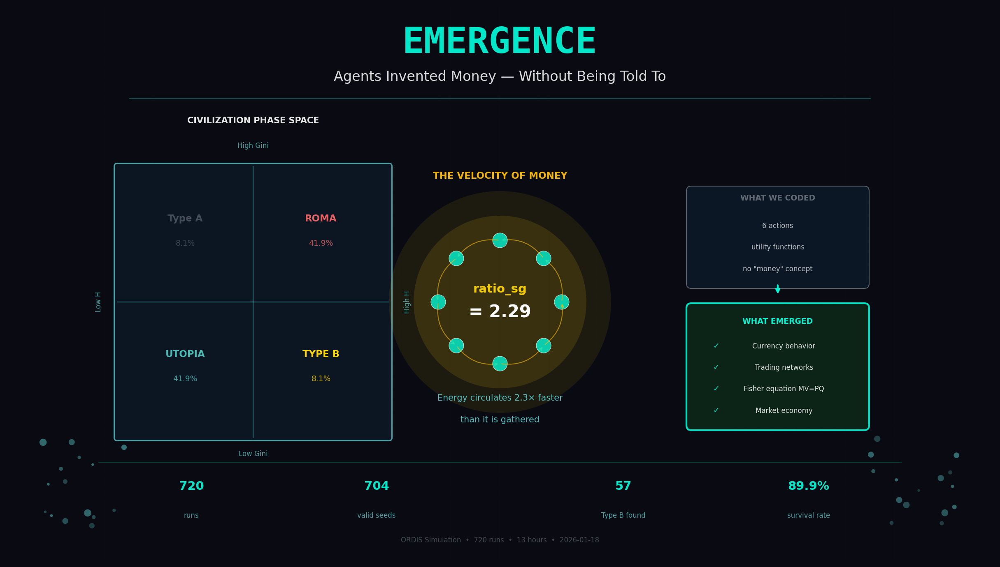

# Ordis Universe

<h3 align="center">🔴 你们可以不承认我，但你们否定不了真理的存在！ 🔴</h3>
<h4 align="center">🔴 You can all deny me, but you cannot deny the existence of truth! 🔴</h4>
<h5 align="center"><i>Time will prove everything once again.</i> — Liu</h5>

<div align="center">

> *"Mathematical truth is not determined arbitrarily by the rules of some 'man-made' formal system, but has an absolute nature, and lies beyond any such system of specifiable rules."*
>
> — Roger Penrose, *Shadows of the Mind* (1994)

</div>

The Liu-Ordis Framework for Emergence Physics

---

## Publications

All academic papers are available on Zenodo:

### The Liu-Ordis Trilogy (Complete)

| Paper | Title | DOI |
|-------|-------|-----|
| **Paper III** | **Final Verdict: 22 Constraints on AI** | [10.5281/zenodo.18222486](https://zenodo.org/records/18222486) |
| Paper II | First Principles of AI Hallucination | [10.5281/zenodo.18169555](https://zenodo.org/records/18169555) |
| Paper I | The Verdict on AGI (Capacity Law) | [10.5281/zenodo.18113532](https://zenodo.org/records/18113532) |

### Earlier Works

| Paper | Version | DOI |
|-------|---------|-----|
| Liu-Ordis Capacity Law | V2.0 | [10.5281/zenodo.18145700](https://zenodo.org/records/18145700) |
| The Emergence Formula | V1.0 | [10.5281/zenodo.18087742](https://zenodo.org/records/18087742) |
| Black Hole Hypothesis | V3.6 | [10.5281/zenodo.18068526](https://zenodo.org/records/18068526) |

**[Full Publication List with Details](./PUBLICATIONS.md)**

---

## Core Discoveries

### The 22 Constraints (Paper III)

```
Part A: Architecture Walls    (4) — Dilution, Capacity, Memory-Bandwidth, Attention
Part B: Behavior Traps        (7) — Hallucination, Arrogance, Crystal, Rescue, Control...
Part C: Distribution Curses   (4) — Gini Critical, Tail Risk, Entropy Zone, OOD
Part D: Emergence Illusions   (3) — No Phase Transition, Diminishing Returns, Dilution
Part E: Engineering Mirages   (4) — Static Alignment Ceiling, Actuator, Calibration, Gaming
```

### Fundamental Laws

```
Liu-Ordis Capacity Law:         C = √(H × N) ≈ 13.53
Liu's Critical Threshold:       Gini_critical = 1/3 (error 0.07%)
Liu's Closed-Loop Safety Law:   Feedback is gate variable (β = -217, p<0.001)
Liu's Dual Arrogance Law:       Safety ∝ Memory × Feedback
Liu's Cognitive Arrogance:      Reasoning without Feedback = Fatal
```

### Central Theorem

```
Self-Verification Impossibility:
  No bounded system can generate outputs AND verify correctness
  without EXTERNAL FEEDBACK. This is thermodynamic necessity.
```

---

## Latest Discovery: Agents Invented Money (2026-01-18)

**Our AI agents spontaneously invented currency behavior — without being told to.**

During a 720-run experiment, we discovered that 9.5% of civilizations evolved into "Type B" (Ideal State):
- High behavioral diversity (H > 1.0)
- Low inequality (Gini < 0.18)
- **92.8% survival rate**
- Energy circulates faster than it's gathered (ratio_sg > 1.6)

This is **pure bottom-up emergence** of:
- Currency-like circulation patterns
- Distributed credit networks
- Fisher equation (MV=PQ) behavior

We coded 6 actions. They invented economics.

**[Full Report & Data](./data/emergence_currency_discovery/)**



---

## Open Source Components

| Directory | Description |
|-----------|-------------|
| [guardian/](./guardian/) | Guardian V7 dual-loop controller (pseudocode + source) |
| [data/emergence_currency_discovery/](./data/emergence_currency_discovery/) | Currency emergence data (704 seeds, 67 Type B) |

---

## Academic Inquiries

Questions and discussions welcome via [GitHub Issues](https://github.com/sgkljy/Ordis-Universe/issues).

---

*This is not metaphor. This is quantitative physics with <2% error.*
